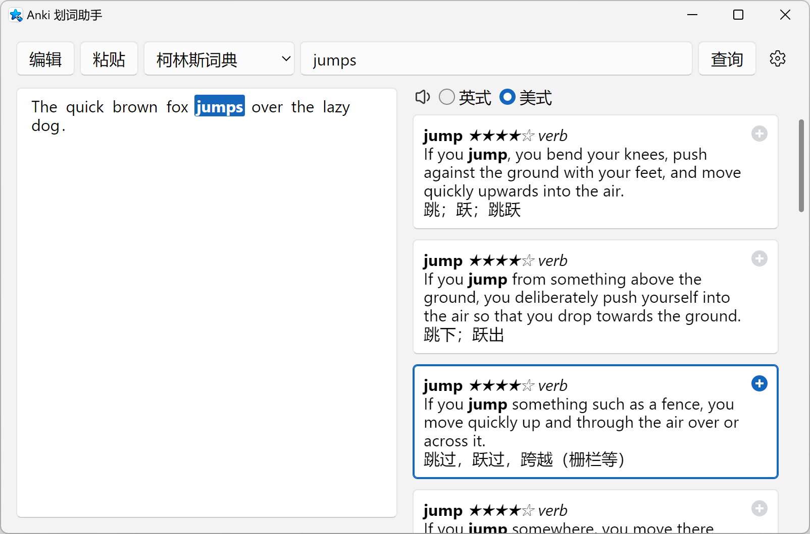
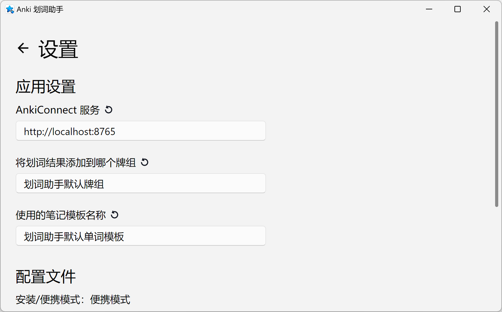
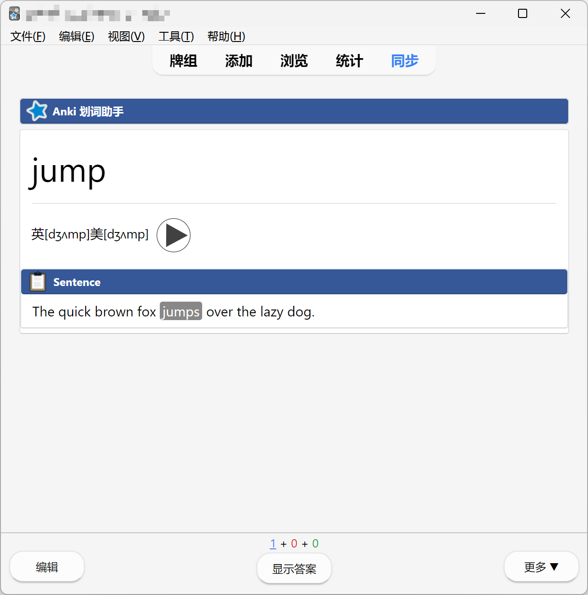
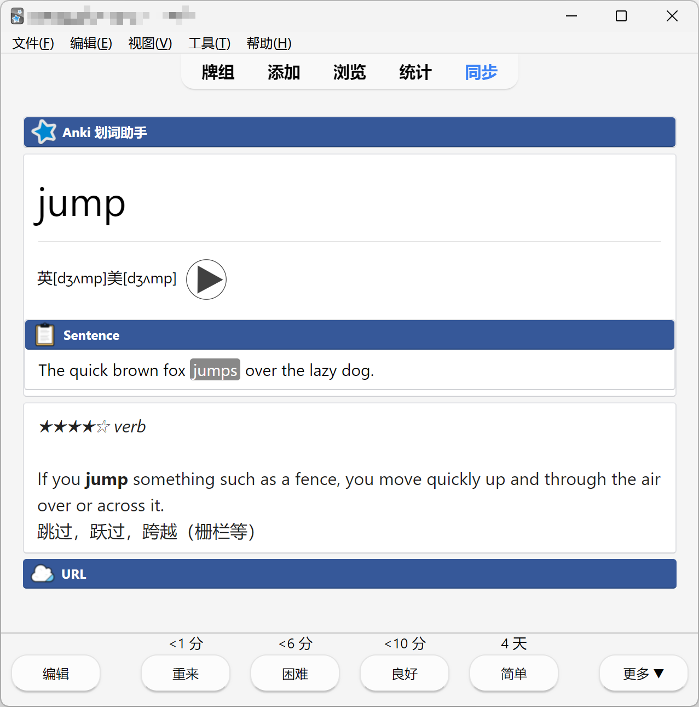

<div align="center">

</div>

<div align="center"><h1>Anki 划词助手</h1></div>

Anki 划词助手是一个制作 Anki 卡片的工具，你可以用它标记句子中的生词，通过“单词结合上下文”的方式更好地背单词。

本项目受到了 [mmjang / ankihelper](https://github.com/mmjang/ankihelper) 的启发。由于原项目是 Android 应用，而且已经不再维护，而我自己用电脑的时间更多，于是自己用 [Tauri](https://github.com/tauri-apps/tauri) 写了一个类似的工具。

<p align="center">

</p>

# 安装
## 安装划词助手本体

[Releases 页面](https://github.com/zhb2000/anki-marker/releases)提供了 Windows 平台的便携式应用（.zip）和安装程序（.msi/.exe），其余平台请自行编译。

Anki 划词助手是一个基于 Tauri 的桌面应用，你的 Windows 系统需要带有 [Microsoft Edge WebView2](https://developer.microsoft.com/zh-cn/microsoft-edge/webview2/) 才能运行（Windows 10 2004 及以上版本已经自带）。

## 安装辅助工具

Anki 划词助手需要通过 AnkiConnect 插件与 Anki 进行通信，你需要先安装 **Anki 应用**和 **AnkiConnect 插件**：

1. 安装 Anki 应用：[Anki - powerful, intelligent flashcards](https://apps.ankiweb.net/)。
1. 安装 AnkiConnect 插件：[AnkiConnect - AnkiWeb](https://ankiweb.net/shared/info/2055492159)。安装方法如下：
    1. 打开 Anki，点击“工具-插件”。
    1. 点击“获取插件”，输入 AnkiConnect 的代码 `2055492159`，点击“确定”。
    1. 重启 Anki 应用。

# 使用

使用 Anki 划词助手时，请确保 **Anki 应用已经打开**，AnkiConnect 的服务会在 Anki 启动时自动开启。

AnkiConnect 默认会在 `localhost:8765` 上启动一个 HTTP 服务，如果你修改了 AnkiConnect 的端口号，请在设置中将“AnkiConnect 服务”这一项修改为对应的 URL：

<p align="center">

</p>

划词界面：

<p align="center">

</p>

添加的 Anki 卡片（正面/背面）：

<p align="center">


</p>

# 开发

开发模式（热重载）：

```shell
cargo tauri dev
# 或者
npm run tauri dev
```

打包成 Windows 安装程序（.msi/.exe）和便携式应用（.zip）：

```shell
node build-for-windows.js
```

打包好的安装程序和便携式应用位于 `src-tauri/target/release/release-assets` 目录下。

在其他平台上构建：

```shell
cargo tauri build
# 或者
npm run tauri build
```

打包好的应用位于 `src-tauri/target/release/bundle` 目录下。
